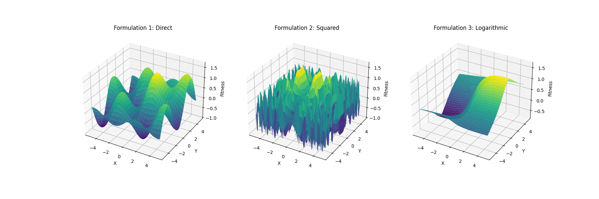
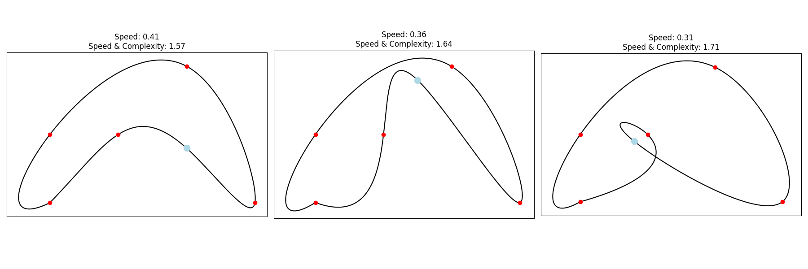
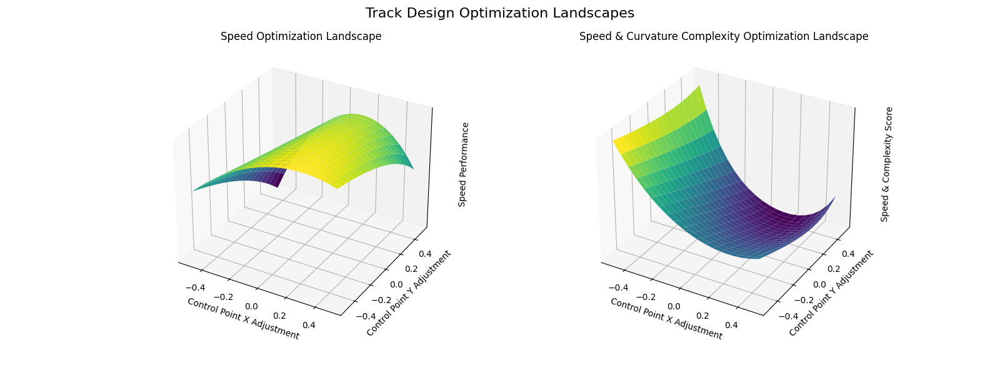

## Introduction
 

  

 

### How I see the topic at hand (succinctly):

This one is important for me due to its deeply abstract roots. They lead everywhere.

Evolutionary computation (EC) is fundamentally about solving problems through the application of evolutionary processes. Algorithms within EC iteratively improve a population of candidate solutions to find the optimal solution, while the field's crux lies in "navigating" the problem space efficiently.

 

### The Language of Navigation:

We often use language like "navigating" a problem, but what does that actually look like?
Navigation refers to how we move through the fitness landscape - a representation of how fit or optimal different solutions are relative to each other (composed by input domain space dimensions + evaluation dimension).

This landscape is shaped by the formulation of the problem itself, which is why this is not the correct starting point. Before navigating a problem, we have to formulate the problem.

 

### Problem Formulation:

There are an infinite amount of different problems. Let's focus on what they share, that is, variables to work with and an evaluation function. 

Some problems are clearly defined, meaning all their priors are stated and from there it's more about navigating within these strongly predefined rules. This is not the case for the majority of problems, thus my objective is to exemplify how formulation can affect the complexity and possible outcomes of future navigation.

I have to be careful with how I create/gather my examples because there's a thin barrier between formulating the same problem in different ways and creating a different problem while formulating it differently. This distinction depends heavily on the initial problem information. When the priors are sufficiently loose, it's imperative to allow intelligence and creativity to guide the formulation.
Remember that, in most cases, successfully redefining a problem with new input variables or evaluation functions still counts as solving the problem as long as it preserves the core objectives.

 

___

 

#### The King's Wine Cellar Problem

As a first example, we have a king's wine cellar that contains 1000 bottles of wine, one of which is poisoned.
The king needs to find the poisoned bottle before a grand feast.

He has prisoners who can taste the wine, but anyone who drinks the poisoned wine will die 24 hours later. 
The feast is in 25 hours. How can the king minimize the number of prisoners who must die to identify the poisoned wine?

 

One prisoner per bottle formulation:
- Assign one prisoner to each bottle.
- Each prisoner drinks from their assigned bottle.
- After 24 hours, identify the poisoned bottle by seeing which prisoner died.

 

Encoding formulation:
- Assign a unique binary number to each wine bottle (from 0 to 999 in binary).
- Use 10 prisoners (log2(1000) rounded up), each representing a bit in the binary number.
- Each prisoner drinks from all bottles that have a 1 in their corresponding bit position.
- After 24 hours, the pattern of which prisoners died reveals the binary number of the poisoned bottle.

 

 

  

 

This is a pretty aggressive problem formulation gap. 
It is achieved by changing the topology of the problem through encoding (transforming the solution space).

Highly successful formulations can sometimes be confused with solutions because they make the solution path almost trivially obvious. In this case, recognizing that encoding could be applied to the problem essentially navigates directly to the solution. The real intellectual leap was in understanding that such an encoding might help, and the subsequent navigation - finding the optimal encoding - becomes straightforward.

Global minima can be extremely worse if one doesn't formulate the problem in the correct way. 

 

___

 

#### Airplane Wing Design Problem

We're designing the perfect wing for an airplane. Our goal is to find the ideal shape that provides the best flight performance. Imagine the following 3 main factors to consider:
- Wing Length: How long the wing is from the fuselage to the tip.
- Wing Curvature: How much the wing bends from front to back.
- Performance: f(x, y) = sin(x) * cos(y) + exp(-((x-2)^2 + (y-2)^2)/10)

The challenge is to find the combination of length and curvature that gives us optimal flight performance and here are example approaches to this:

 

  

 

- Direct formulation: Looking at a basic map of possible wing designs. Straightforward.
- Squared formulation: Emphasizes how small changes in our design can have big effects, especially as we push the limits of wing size or curvature. It's like zooming in on the extreme ends of our design possibilities.
- Logarithmic formulation: Dampens local variations and emphasizes overall trends in the design space.

Each one impacts the fitness landscape and further navigation complexity.

 

___

 

#### Exciting racing track

Finally, let's move away from examples in which the input variables were somehow efficiently exploited/transformed and see how different definitions for evaluation functions affect problem navigation.

This example belongs to the set of problems where we can assume priors are sufficiently loose to the point where one shouldn't care about the "is it still the same problem after that reformulation?" debate.

Our goal is simply to create an exciting track for public and driver experience.

We define our track using a series of control points, which are then interpolated to create a smooth, continuous 2D layout. Specifically, our track is defined by 6 control points, each with x and y coordinates, resulting in a 12-dimensional optimization problem. Here are some example track layouts:

 

  

 <small> Note: In these examples, we're modifying only one control point (highlighted in blue) while keeping the others constant. However, due to the nature of cubic interpolation used to create smooth curves between points, changing one point can affect the curvature of the entire track. This is why one might notice slight differences in the track shape even in areas far from the modified point. </small>

 
 
 

While the full optimization problem involves all 12 dimensions (6 2D control coordinates each), visualizing such a high-dimensional space is challenging. To gain insights into the problem structure, we'll examine how changes to a single control point affect our optimization objectives, while keeping all other points fixed.

- Speed-focused formulation:
Considers the overall potential for high speeds on the track. It's calculated based on the track's average curvature, with straighter sections contributing to a higher score.

- Speed&Curvature-focused formulation:
Takes into account both speed potential and layout complexity. It considers the variation in curvature along with overall speed potential, taking into account fast sections with tough turns.

The key here is understanding that different stakeholders might prioritize these aspects differently. A track designer focused purely on speed might create a very different layout compared to one who values a mix of speed and technical challenges.

The following plots show how adjusting the x and y coordinates of one specific control point affects the track's performance in terms of speed or/and curvature:

 

  

 

The x and y axes represent adjustments to the x and y coordinates of a single control point.
The z-axis represents the performance score for either formulation.

It's important to note that these visualizations represent only a slice (that will change if any of the other dimensions change) of the 12-dimensional optimization domain space. 

The differing landscapes illustrate how the two evaluation functions lead to different optimal solutions, highlighting the multi-objective nature of optimization.

 

___

 

### Navigation revisited & final thoughts:

See, problem formulation ultimately shapes any problem topology that we tackle, and problems are typically way more complex and multidimensional than any of the visited examples. 

One does not need to be able to quantify and precisely define this formulation event to know that its ultimate representation is a shift in a topology.

In more abstract problems, i.e. philosophical problems/modelling reality, formulation is connected with one's exposure and interpretations of ideas, personality and more... These are all variables that, when changed or introduced, can bring novelty to our navigation process outcomes.

In more concrete problems, i.e. deep learning modelling, one needs to navigate the loss surface that represents the high-dimensional weight space and the continuous error it originates in relationship to our targets. A solution is a point in the weight space that represents a single function (matrix composition) and hopefully it is good enough mimicking the real function.

Formulation is the main focus of most of DL research. Methods like explicit L2 regularization, dropout, applying noise to weights or data, early stopping, data augmentation, ensembling or even architecture design decisions like residual connections, applying transformations/abstract feature engineering to the input like convolutions or making inputs attend to others are just ways of saying "let me just make some assumptions that might help you deal with all these peaks and valleys" to the actual navigation algorithm.

SGD/ADAM can be though as an evolutionary algorithm that evolves a single point through continous gradient information (relevance realization).

Going back to the context of (more general) computer science, one must create meta-heuristic algorithms that are able to deal with complexity, hopefully being able to progress through local optimas and reaching global optima(s). 

A navigation process must be able to perceive fitness (relevance realization) and deal with peaks and valleys that might be not be global optima(s). The latter is very hard to deal with in the limit without extensive search. It's not like one has a map of a difficult problem, as a map implies a priori presence of solutions, and difficult problems are continuous navigations of the unknown.

___

So problem formulation optimizes problem navigation... what optimizes problem formulation itself? 

Problem navigation. Recursive.

Human awareness is itself an evolved algorithm that deals with the problem of problem formulation, to then deal with the navigation of different problems. One could say that anything that optmizes this is fluid intelligence and/or creativity.

