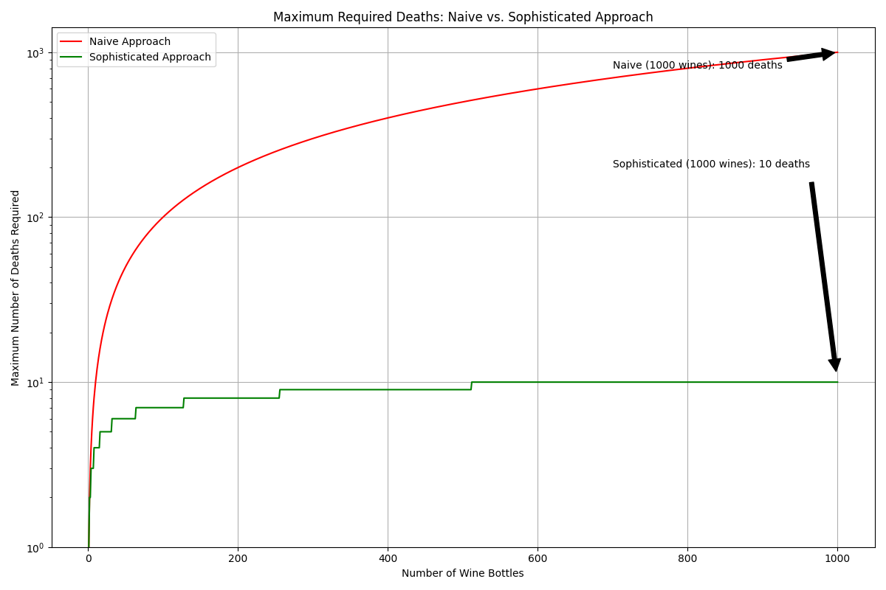

## Introduction
 

  

 

### How I see the topic at hand (succinctly):

This one is important for me due to its deeply abstract roots. They lead everywhere.

Evolutionary computation (EC) is fundamentally about solving problems through the application of evolutionary processes. Algorithms within EC iteratively improve a population of candidate solutions to find the optimal solution, while the field's crux lies in "navigating" the problem space efficiently.

 

### The Language of Navigation:

We often use language like "navigating" a problem, but what does that actually look like?
Navigation refers to how we move through the fitness landscape - a representation of how fit or optimal different solutions are relative to each other (composed by input domain space dimensions + evaluation dimension).

This landscape is shaped by the formulation of the problem itself, which is why this is not the correct starting point. Before navigating a problem, we have to formulate the problem.

 

### Problem Formulation:

There are an infinite amount of different problems. Let's focus on what they share, that is, variables to work with and an evaluation function. 
Some problems are clearly defined, meaning all their priors are stated and from there it's more about navigating within these strongly predefined rules. This is not the case for the majority of problems, thus my objective is to exemplify how formulation can affect the complexity and possible outcomes of future navigation.

I have to be careful with how I create/gather my examples because there's a thin barrier between formulating the same problem in different ways and creating a different problem while formulating it differently. This distinction depends heavily on the initial problem information. When the priors are sufficiently loose, it's imperative to allow intelligence and creativity to guide the formulation.
Remember that, in most cases, successfully redefining a problem with new input variables or evaluation functions still counts as solving the problem as long as it preserves the core objectives.

 

___

 

#### The King's Wine Cellar Problem

As a first example, we have a king's wine cellar that contains 1000 bottles of wine, one of which is poisoned.
The king needs to find the poisoned bottle before a grand feast.

He has prisoners who can taste the wine, but anyone who drinks the poisoned wine will die 24 hours later. 
The feast is in 25 hours. How can the king minimize the number of prisoners who must die to identify the poisoned wine?

 

One prisoner per bottle formulation:
- Assign one prisoner to each bottle.
- Each prisoner drinks from their assigned bottle.
- After 24 hours, identify the poisoned bottle by seeing which prisoner died.

 

Encoding formulation:
- Assign a unique binary number to each wine bottle (from 0 to 999 in binary).
- Use 10 prisoners (log2(1000) rounded up), each representing a bit in the binary number.
- Each prisoner drinks from all bottles that have a 1 in their corresponding bit position.
- After 24 hours, the pattern of which prisoners died reveals the binary number of the poisoned bottle.

 

 

  

 

This is a pretty aggressive problem formulation gap. 
It is achieved by changing the topology of the problem through encoding (transforming the solution space).

Highly successful formulations can sometimes be confused with solutions because they make the solution path almost trivially obvious. In this case, recognizing that encoding could be applied to the problem essentially navigates directly to the solution. The real intellectual leap was in understanding that such an encoding might help, and the subsequent navigation - finding the optimal encoding - becomes straightforward.

Global minima can be extremely worse if one doesn't formulate the problem in the correct way. 

2. **Airplane Wing Design Problem**

3. **Evaluation Function Impact**

(Detailed explanations and images for each example would be inserted here)

 

___

 

### The Interplay of Formulation and Navigation:

See, problem formulation ultimately molds any problem topology that we tackle, and it's typically way more complex and multidimensional than any examples. For better or worse, our way of interpreting things plays a big part. We don't need to be able to quantify and precisely define this event happening to know that its ultimate representation is a shift in a topology.

So problem formulation optimizes problem navigation... what optimizes problem formulation itself?

Problem navigation.

Our model of human awareness is itself an evolved algorithm that deals with the problem of problem formulation, to then deal with the navigation of that problem. I would say that anything that tries to optimize [this process] is general intelligence.

 

___

 

### Conclusion

How general? As general as one's ability to translate a problem into a symbolic or numerical domain space while also defining an evaluation function.

See, all problems have their own topologies, even if one can't see them. What evolutionary algorithms try to do is simply navigate those topologies computationally, often mimicking biological behaviours.
