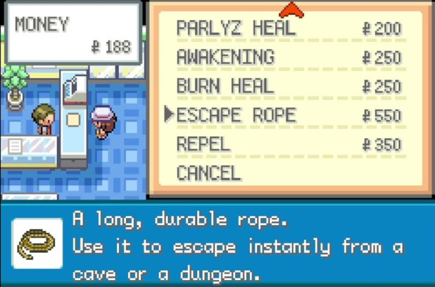
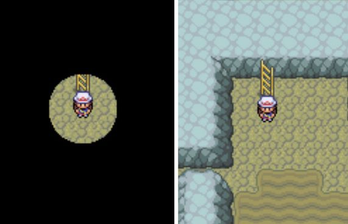

## Escape rope

 

  

 

---

 

When I was around 7/8 years old I was playing Pokemon Leaf Green on my GBA SP and there was this cave called 'Rock Tunnel' and it was essentially a maze with multiple levels where one would need an ability called 'Flash' in order to light up one's surroundings, effectively being able to easily navigate and get to the other side. 

As a kid, I had this strange way of playing where I didn't want my pokemons to faint although that not a problem at all since one can revive them.

My english skills were almost non-existent back then, so I never understood the procedure on how to get Flash prior to entering the cave, although I think I knew it wasn't supposed to be that dark.

I used to like doing these scale models of cities with old shoe boxes (art attack style) and I went to get some material. I started drawing and gluing some paper while going through the cave, always moving close to the cave's walls. 

 

---

 

  

 

---

 

My objective was to map out the cave's boundaries and other points of interest, preparing for the case where I made a mistake and/or need to stop and start over after healing my pokemons. This was also when I realized one could always escape any maze by just commmiting to connect to either side of the maze and moving alongside it. 

The escape rope played a big role. With it, I would be able to go back to the beginning whenever I felt I needed to heal, not having to go back and potentially risk not being able to escape some combats and not compromising progress.

This escape rope can be seen a prior plateau, a prior saved state, a stable and structured region of the search space where one can effectively come back to and rest, reload and start the navigation process again.

In practical terms, one's escape rope is the set of things one values the most. In a deep sense it's a place of familiarity. 

I'm pretty sure the first time I thought of the escape rope like this was when I concluded that Jung's escape rope was probably stronger than Nietzsche's (which I might eventually touch on less superficially). But the theme is recurrent... the escape rope is there because it is present as a variable of one's mental model, regardless of the attention one gives to it. But the less attention one gives to it, the harder it is to find whenever needed because our mental models can stray away from that point.

These thoughts give me some sort of reminder to be grateful for simple things around me, whether new friendships, old family relationships, my ambition and objectives, walking breaks from work... and so much more.

